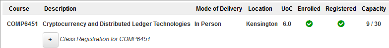

# COMP6451-Project-2019

  
*Cryptocurrency and Distributed Ledger Technologies.*

**COMP6451 Project** | [COMP6451 Brief](./COMP6451-BRIEF.md)

## Contents

Self-explanatory.

1. A homework assignment.
2. A PPT presentation.
3. The coding assignment. Performed in SOLIDITY, online-compiler flavour.

## References

* K. S. McCurley and C. D. Ziegler. 1998. *Advances in Cryptology 1981–1997*. Springer, Berlin. DOI: [https://doi.org/10.1007/3-540-49677-7](https://doi.org/10.1007/3-540-49677-7) . ISBN 978-3-540-65069-0, 978-3-540-49677-9.
